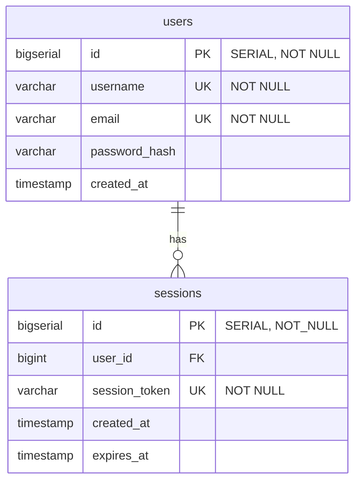

_This project has been created as part of the 42 curriculum by jpelline, anpollan, mhrvasm, zfarah and nraatika._

# Backend & Database

## Description

This repo hosts the **Go** Backend server, the **Postgres** Database server, and related infrastructure code

### Team Information

Lead developer for backend: Niklas Raatikainen
Contributions:

### Technical Stack

#### Docker

Docker is used to run separate services in isolated containers and networks, controlled by a Docker Compose file.

- at the front gate there is a **Caddy** container acting as a reverse proxy, listening for incoming HTTPS traffic on port 8443 (it also accepts incoming HTTP traffic on port 8000 only for upgrade-to-HTTPS purposes). For testing purposes, it routes some traffic to a static index.html file it's serving, but traffic to `/api/*` gets routed to the **Backend server**, which in turn connects to the **Database Server**.

#### Backend server

- The backend server is written in **Golang**, with the standard library `http.ServeMux` package doing the basic work of serving API endpoints
- We use some third-party packages in addition to the Go standard:
  - To facilitate the connection to the **Database Server** we use the **Bun ORM** package [\[Docs\]](https://bun.uptrace.dev/) / [\[GitHub\]](https://github.com/uptrace/bun)
  - For password hashing we use the **Crypto** package [\[GitHub\]](https://github.com/x/crypto)
  - For input validation before passing things to the database we use the **Validator** package [\[GitHub\]](https://go-playground/validator/v10)
  - To handle graceful use of `.env`-files we use the **godotenv** package [\[GitHub\]](https://go-playground/validator/v10)
  - To help with automated testing we use the **testify** package [\[GitHub\]](https://github.com/stretchr/testify)

##### Internal packages

To help keep the server maintainable, code is internally divided into a few packages:

- `main` sets up and starts the server
- `db` handles setting up the database connection, and running any needed migrations (setting up tables in the database, etc)
- `models` defines the translation of structs in Go to database tables in Postgres (you pass a struct defined in `models` as an argument to the Bun DB connection, and Bun uses that model to correctly translate that to SQL queries that get sent to the database)
- `handlers` package define handlers for each endpoint we're serving
- `internal/testutil` package contains helpers to testing functions
- `handlers_test` package contains tests to validate that the handlers are working correctly, including some integration tests with the DB
- `models_test` package contains tests to validate the models integrate correctly with the DB tables

#### Database Schema



---

## Instructions

To test out, you must create a `secrets/` folder parallell to the root of the repo, and make a file called `postgres_user_pw.txt` containing the password used to connect to the DB, and fill out `.env.example` into `.env`. You can then launch the backend and database containers with the command

```
docker compose up -d --build
```

which should result in:

- containers `database`, `caddy` and `backend` launching
- the backend establishing a connection to the DB
- the backend creating the `users` and `sessions` tables in the DB, as specified in `backend/db/migrations/`
- the backend registering handlers for endpoints
  - `/api/register`
  - `/api/login`
- the reverse proxy `caddy` exposing ports 8000 (HTTP) and 8443 (HTTPS), while backend and databse no longer expose any ports to the host network

Functionality can be tested by accessing `https://localhost:8443/index.html`, which is a simple, static frontend that has register and login forms with live access to the database, so you can check the response a request generates.

### Endpoints

#### `register`

The register endpoint is expecting a request with type `application/json`, as defined in `handlers/register.go`:

```
type RegisterRequest struct {
	Username string `json:"username" validate:"required,min=3,max=50,username_safety"`
	Password string `json:"password" validate:"required,min=8,max=72,password_complexity"`
	Email    string `json:"email" validate:"required,email,max=255"`
}
```

This means all fields are required, there are length constraints on all, the keys must be exactly as stated in the tag string, and username and password have additional constraints that are checked before trying to add a user to the database, named `username_safety`, and `password complexity`. These constraints, and JSON conformity, is checked by the `DecodeAndValidate` function, which is run before trying to add the new user to the DB, with any missed constraints passed back to the requester in the body of the `BadRequest` response.

If input passes validation, a password hash is generated using the `bcrypt` algorithm, which is what is stored in the database.

We use Bun ORM to try to insert the new user to the database, however both `username` and `email` fields have the unique constraint, so insertion may be expected to fail on duplicate input to an existing account for either field, and that error is returned to the requester as a `Conflict` response.

##### `username_safety`

This checks that the username contains only alphanumerics, underscores and dashes

##### `password complexity`

This checks that the password contains characters from at least two of the categories `[uppercase, lowercase, digit, special]`.

#### `login`

The login endpoint expects a request with type `application/json`, as defined in `handlers/auth.go`:

```
type LoginRequest struct {
	Username string `json:"username" validate:"required,min=3,max=50"`
	Password string `json:"password" validate:"required,min=8,max=72"`
}
```

Here we only check the length constraints before trying to fetch user info with the given input, using `bcrypt` to check whether the given password matches the hashed one in the database if the user was founf, and returns a response. Currently the response is a `OK` status with the User struct as the body of the response, we'll update to a token in the near future.

### Testing

Testing can be run from the terminal:

```
`./backend/scripts/run_tests.sh`
```

It spins up the db container, exposing the DB_PORT on localhost to grant local access to the db for testing (via `docker-compose.override.yml`), runs the tests defined in the various `*_test.go`-files, and brings the db container back down.

---

## Resources

list of used resources
