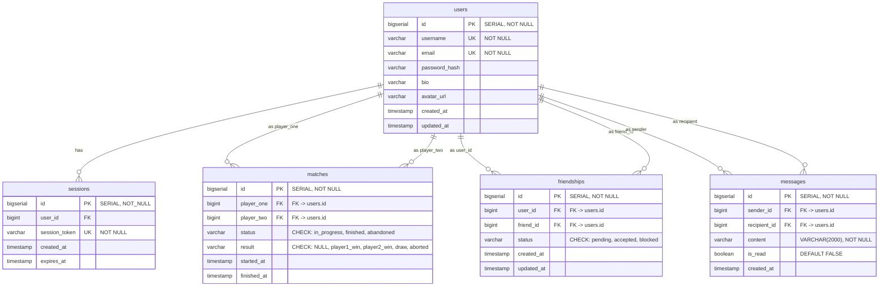

_This project has been created as part of the 42 curriculum by jpelline, anpollan, mhrvasm, zfarah and nraatika._

# Backend & Database

## Description

This repo hosts the **Go** Backend server, the **Postgres** Database server, and related infrastructure code

### Team Information

Lead developer for backend: Niklas Raatikainen
Contributions:

### Technical Stack

#### Docker

Docker is used to run separate services in isolated containers and networks, controlled by a Docker Compose file.

- at the front gate there is a **Caddy** container acting as a reverse proxy, listening for incoming HTTPS traffic on port 8443 (it also accepts incoming HTTP traffic on port 8000 only for upgrade-to-HTTPS purposes). Traffic to `/api/*` gets routed to the **Backend server**, which in turn connects to the **Database Server**.

#### Backend server

- The backend server is written in **Golang**, with the standard library `http.ServeMux` package doing the basic work of serving API endpoints
- We use some third-party packages in addition to the Go standard:
  - To facilitate the connection to the **Database Server** we use the **Bun ORM** package [\[Docs\]](https://bun.uptrace.dev/) / [\[GitHub\]](https://github.com/uptrace/bun)
  - For password hashing we use the **`crypto`** package [\[GitHub\]](https://github.com/x/crypto)
  - For input validation before passing things to the database we use the **`validator`** package [\[GitHub\]](https://go-playground/validator/v10)
  - To handle graceful use of `.env`-files we use the **`godotenv`** package [\[GitHub\]](https://go-playground/validator/v10)
  - To help with automated testing we use the **`testify`** package [\[GitHub\]](https://github.com/stretchr/testify)
  - To handle JWT creation and testing, we use a **`jwt`** package [\[GitHub\]](https://github.com/golang-jwt/jwt/v5)
  - For real-time WebSocket communication we use **`gorilla/websocket`** [\[GitHub\]](https://github.com/gorilla/websocket)

##### Internal packages

To help keep the server maintainable, code is internally divided into a few packages:

- `main` sets up and starts the server
- `db` handles setting up the database connection, and running any needed migrations (setting up tables in the database, etc)
- `models` defines the translation of structs in Go to database tables in Postgres (you pass a struct defined in `models` as an argument to the Bun DB connection, and Bun uses that model to correctly translate that to SQL queries that get sent to the database)
- `handlers` package define handlers for each endpoint we're serving
- `realtime` package defines the WebSocket Hub, connection pumps, and online presence tracking
- `internal/testutil` package contains helpers to testing functions
- `handlers_test` package contains tests to validate that the handlers are working correctly, including some integration tests with the DB
- `models_test` package contains tests to validate the models integrate correctly with the DB tables

#### Database Schema



##### TODO:

---

## Instructions

To test out, you must create a `secrets/` folder parallell to the root of the repo, and make a file called `postgres_user_pw.txt` containing the password used to connect to the DB, and run the commands to create private and public key files in that folder:

```
openssl genpkey -algorithm RSA -out jwt_private.pem -pkeyopt rsa_keygen_bits:2048
openssl rsa -pubout -in jwt_private.pem -out jwt_public.pem
```

fill out `.env.example` into `.env`. You can then launch the backend and database containers with the command

```
docker compose up -d --build
```

which should result in:

- containers `database`, `caddy-test` and `go-server` launching
- the backend establishing a connection to the DB
- the backend creating the `users`, `sessions`, `matches`, `friendships` and `messages` tables in the DB, as specified in `backend/db/migrations/`
- the backend registering handlers for endpoints
  - `/api/register`
  - `/api/login`
  - `/api/renew`
  - `/api/protected/profile`
  - `/api/protected/profile/{username}`
  - `/api/protected/friends`
  - `/api/protected/friends/{id}`
  - `/api/protected/messages/{friend_name}`
  - `/api/protected/messages/{friend_name}/read`
  - `/api/ws`
  - `/api/internal/matches`
  - `/api/internal/matches/{id}`
  - `/api/internal/messages`
  - `/api/internal/friends/{id}`
- the reverse proxy `caddy-test` exposing ports 8000 (HTTP) and 8443 (HTTPS), while backend and databse don't expose any ports to the host network

Functionality can be tested using Postman.

### Endpoints

#### Open endpoints

##### `POST /api/register`

The register endpoint is expecting a request with type `application/json`, as defined in `handlers/register.go`:

```
type RegisterRequest struct {
	Username string `json:"username" validate:"required,min=3,max=50,username_safety"`
	Password string `json:"password" validate:"required,min=8,max=72,password_complexity"`
	Email    string `json:"email" validate:"required,email,max=255"`
}
```

This means all fields are required, there are length constraints on all, the keys must be exactly as stated in the tag string, and username and password have additional constraints that are checked before trying to add a user to the database, named `username_safety`, and `password complexity`. These constraints, and JSON conformity, is checked by the `DecodeAndValidate` function, which is run before trying to add the new user to the DB, with any missed constraints passed back to the requester in the body of the `BadRequest` response.

If input passes validation, a password hash is generated using the `bcrypt` algorithm, which is what is stored in the database.

We use Bun ORM to try to insert the new user to the database, however both `username` and `email` fields have the unique constraint, so insertion may be expected to fail on duplicate input to an existing account for either field, and that error is returned to the requester as a `Conflict` response.
The following user-defined checks are done:

- `username_safety`
  - This checks that the username contains only alphanumerics, underscores and dashes
- `password complexity`
  - This checks that the password contains characters from at least two of the categories `[uppercase, lowercase, digit, special]`.

##### `POST /api/login`

The `login` endpoint expects a request with type `application/json`, as defined in `handlers/auth.go`:

```
type LoginRequest struct {
	Username string `json:"username" validate:"required,min=3,max=50"`
	Password string `json:"password" validate:"required,min=8,max=72"`
}
```

Here we only check the length constraints before trying to fetch user info with the given input, using `bcrypt` to check whether the given password matches the hashed one in the database if the user was found, and returns a response. If login is succesfull, a new entry is created into the `sessions` table in the DB, containing a unique, random 26-character string, that is returned to the caller as a secure, HttpOnly cookie with the name `session_id`. Cookie is valid 24 hours.

#### Cookie-protected route

This route requires a `session_id`-cookie to be attached to the request, or it's rejected. This is handled by a middleware that checks in the that the given session exists and is valid in the `sessions` table, and fetches the data of the `user` referred to in that entry, and attaches it to the request, so the handler doesn't need to do a separate request.

##### `POST /api/renew`

The `renew` endpoint issues a JWT signed with a private key using `RS256`, with the users' username and id as the payload, as well as the required fieds:

```
RegisteredClaims: jwt.RegisteredClaims{
			Issuer:    "dbBackend",
			Subject:   strconv.Itoa(int(user.ID)),
			IssuedAt:  jwt.NewNumericDate(now),
			NotBefore: jwt.NewNumericDate(now),
			ExpiresAt: jwt.NewNumericDate(now.Add(lifetime)),
		},
```

We use 60s as the lifetime currently.

#### API key protected routes: `/api/internal/*`

These routes are intended to be used by the game server when it needs to get or store data in the database. This is accomplished by a middleware, that checks whether the request has a key provided in the header, and that it matches a known key

##### `POST /api/internal/matches`

Used to create a new match entry in the database. The expected request body, as defined in `matches.go`:

```
type MatchCreateInput struct {
	Player1 int64 `json:"player_one" validate:"required"`
	Player2 int64 `json:"player_two" validate:"required"`
}
```

So to create a match record, you just send the player ids. The `status` field is set to "`in_progress`". If successful, the return is a JSON with the content

```
{
  "match_id": <id>
}
```

This value can be later used to update the result of the match:

##### `PATCH /api/internal/matches/{id}`

Used to update a match with a result. The expected request body, as defined in `matches.go`:

```
type MatchPatchInput struct {
	Result string `json:"result" validate:"required,oneof=player1_win player2_win draw aborted"`
	Status string `json:"status" validate:"required,oneof=finished abandoned"`
}
```

This means that the "`result`" must be one of `player1_win`, `player2_win`, `draw` or `aborted`, and "`status`" must be one of `finished` and `abandoned`

To perform an update, we first filter the `matches` table to only include entries with the `id` specified in the request address, and only ones where status is `in_progress`. This means a match result can only be updated once, while trying to update an id that doesn't exist in the table or that doesn't have status `in_progress`, results in an error `http.StatusConflict` (409) being returned.

##### `POST /api/internal/messages`

Used internally by the WebSocket service to persist chat messages. Expected request body:

```json
{
  "sender_id": 1,
  "recipient_id": 2,
  "content": "Hey! Up for a game?"
}
```

Returns `201 Created` with the created `Message` object.

##### `GET /api/internal/friends/{id}`

Used internally by the WebSocket service to fetch the list of relationships for a specific user ID.

#### JWT protected routes: `/api/protected/*`

These routes are protected by a JWT checking middleware, which will extract the userid from the token after validating the signature and expiration status. That id is passed on to the handlers in the request context.

##### `GET /api/protected/profile`

Returns the authenticated user's own profile data:

```json
{
  "username": "nraatika",
  "email": "nraatika@student.hive.fi",
  "bio": "Hello world",
  "avatarUrl": "https://example.com/avatar.png"
}
```

##### `GET /api/protected/profile/{username}`

Returns public profile information for a specific user:

```json
{
  "username": "mhirvasm",
  "bio": "Player bio",
  "avatarUrl": null
}
```

##### `PATCH /api/protected/profile`

Updates the authenticated user's profile with optional fields:

```json
{
  "bio": "Updated bio text",
  "avatarUrl": "https://example.com/new-avatar.png",
  "email": "newemail@student.hive.fi"
}
```

Returns the updated `UserProfile` JSON object.

##### `DELETE /api/protected/profile`

Soft-deletes and anonymizes the user's account (renaming `username` to `deleted_user_<id>`, wiping email, password hash, bio, and avatar) to preserve match history integrity, and invalidates all active sessions. Returns `200 OK`.

##### `GET /api/protected/friends`

Returns a list of all relationships (accepted friends, incoming/outgoing pending requests, and blocked users initiated by the caller):

```json
[
  {
    "friendship_id": 1,
    "user_id": 2,
    "username": "mhirvasm",
    "avatar_url": null,
    "status": "pending",
    "is_incoming": true
  }
]
```

##### `POST /api/protected/friends`

Sends a friend request to a target user:

```json
{
  "target_id": 2
}
```

Returns `201 Created` with the newly created friendship ID:

```json
{
  "id": 1,
  "status": "pending"
}
```

##### `PATCH /api/protected/friends/{id}`

Accepts a pending friend request or blocks a user:

```json
{
  "status": "accepted"
}
```

Allowed `status` values: `accepted`, `blocked`.

##### `DELETE /api/protected/friends/{id}`

Declines a pending friend request, cancels an outgoing request, or removes an existing friend. Returns `204 No Content`.

##### `GET /api/protected/messages/{friend_name}`

Retrieves the chat history (last 100 messages) between the authenticated user and a specific friend in chronological order:

```json
[
  {
    "id": 1,
    "sender_id": 1,
    "recipient_id": 2,
    "content": "Hey! Want to play a match?",
    "is_read": true,
    "created_at": "2026-08-25T14:50:00Z"
  }
]
```

##### `PATCH /api/protected/messages/{friend_name}/read`

Marks incoming messages from a specific friend as read up to a specified message ID:

```json
{
  "read_up_to": 105
}
```

Returns `204 No Content`.

#### Real-time WebSocket: `/api/ws`

The server provides a full-duplex WebSocket endpoint for online presence tracking and real-time chat.

##### Connection Handshake

* **URL:** `wss://localhost:8443/api/ws?token=<jwt_token>`
* **Authentication:** Passes the JWT token in the `token` query parameter. Validated using the RSA public key.

##### Protocol Format

All messages sent over the WebSocket use a standard JSON envelope:

```json
{
  "type": "<event_type>",
  "payload": { ... }
}
```

##### Server-to-Client Events

* **`initial_presence`**: Sent immediately upon connecting with a list of currently online friends:
  ```json
  {
    "type": "initial_presence",
    "payload": {
      "online_users": ["mhirvasm", "jpelline"]
    }
  }
  ```

* **`presence_update`**: Broadcast to online friends when a user connects (`online_status: true`) or disconnects (`online_status: false`):
  ```json
  {
    "type": "presence_update",
    "payload": {
      "username": "mhirvasm",
      "online_status": true
    }
  }
  ```

### Testing

Testing can be run from the terminal:

```
`./backend/scripts/run_tests.sh`
```

It spins up the db container, exposing the DB_PORT on localhost to grant local access to the db for testing (via `docker-compose.override.yml`), runs the tests defined in the various `*_test.go`-files, and brings the db container back down.

---

## Resources

list of used resources
