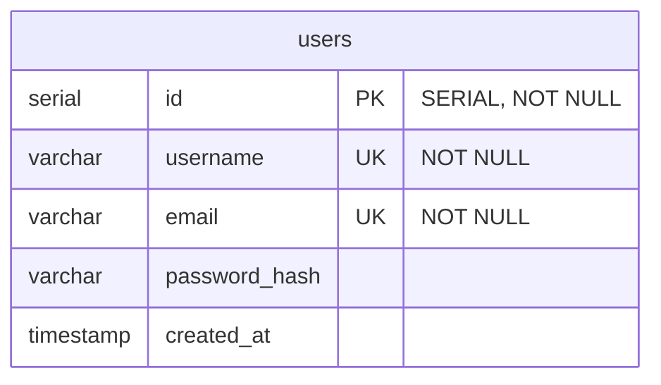

_This project has been created as part of the 42 curriculum by jpelline, anpollan, mhrvasm, zfarah and nraatika._

# Transcendence

## Description

We've creating a web-accessible multiplayer game.

### Team Information

#### Assigned roles

- **Product Owner**:
- **Project Manager**:
- **Technical Lead**:
- **Developers**:
- Brief description of their responsibilities.

#### Project Management

◦ How the team organized the work (task distribution, meetings, etc.).
◦ Tools used for project management (GitHub Issues, Trello, etc.).
◦ Communication channels used (Discord, Slack, etc.).

#### Technical Stack

◦ Frontend technologies and frameworks used.
◦ Backend technologies and frameworks used.
◦ Database system and why it was chosen.
◦ Any other significant technologies or libraries.
◦ Justification for major technical choices.

#### Database Schema



#### Features List

◦ Complete list of implemented features.
◦ Which team member(s) worked on each feature.
◦ Brief description of each feature’s functionality

#### Modules

◦ List of all chosen modules (Major and Minor).
◦ Point calculation (Major = 2pts, Minor = 1pt).
◦ Justification for each module choice, especially for custom "Modules of
choice".
◦ How each module was implemented.
◦ Which team member(s) worked on each module

#### Individual Contributions

◦ Detailed breakdown of what each team member contributed.
◦ Specific features, modules, or components implemented by each person.
◦ Any challenges faced and how they were overcome.

---

## Instructions

To test out, you must create a `secrets/` folder parallell to the root of the repo, and make a file called `postgres_user_pw.txt` containing the password used to connect to the DB, and fill out `.env.example` into `.env`. You can then launch the backend and database containers with the command

```
docker compose up --build
```

which should result in:

- containers `database`, `caddy` and `backend` launching
- the backend establishing a connection to the DB
- the backend creating the `users` table in the DB, as specified in `backend/db/migrations/`
- the backend registering handlers for endpoints
  - `/api/register`
  - `/api/login`
- the reverse proxy `caddy` exposing ports 8000 (HTTP) and 8443 (HTTPS), while backend and databse no longer expose any ports to the host network

Functionality can be tested by accessing `https://localhost:8443/index.html`, which is a simple, static frontend that has register and login forms with live access to the database, so you can check the response a request generates.

### Endpoints

#### `register`

The register endpoint is expecting a request with type `application/json`, as defined in `handlers/register.go`:

```
type RegisterRequest struct {
	Username string `json:"username" validate:"required,min=3,max=50,username_safety"`
	Password string `json:"password" validate:"required,min=8,max=72,password_complexity"`
	Email    string `json:"email" validate:"required,email,max=255"`
}
```

This means all fields are required, there are length constraints on all, the keys must be exactly as stated in the tag string, and username and password have additional constraints that are checked before trying to add a user to the database, named `username_safety`, and `password complexity`. These constraints, and JSON conformity, is checked by the `DecodeAndValidate` function, which is run before trying to add the new user to the DB, with any missed constraints passed back to the requester in the body of the `BadRequest` response.

If input passes validation, a password hash is generated using the `bcrypt` algorithm, which is what is stored in the database.

We use Bun ORM to try to insert the new user to the database, however both `username` and `email` fields have the unique constraint, so insertion may be expected to fail on duplicate input to an existing account for either field, and that error is returned to the requester as a `Conflict` response.

##### `username_safety`

This checks that the username contains only alphanumerics, underscores and dashes

##### `password complexity`

This checks that the password contains characters from at least two of the categories `[uppercase, lowercase, digit, special]`.

#### `login`

The login endpoint expects a request with type `application/json`, as defined in `handlers/auth.go`:

```
type LoginRequest struct {
	Username string `json:"username" validate:"required,min=3,max=50"`
	Password string `json:"password" validate:"required,min=8,max=72"`
}
```

Here we only check the length constraints before trying to fetch user info with the given input, using `bcrypt` to check whether the given password matches the hashed one in the database if the user was founf, and returns a response. Currently the response is a `OK` status with the User struct as the body of the response, we'll update to a token in the near future.

### Testing

Testing can be run from the terminal:

```
`./backend/scripts/run_tests.sh`
```

It spins up the db container, exposing the DB_PORT on localhost to grant local access to the db for testing (via `docker-compose.override.yml`), runs the tests defined in the various `*_test.go`-files, and brings the db container back down.

---

## Resources

list of used resources
