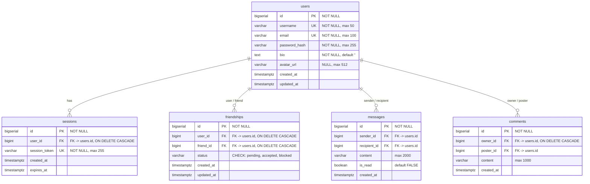
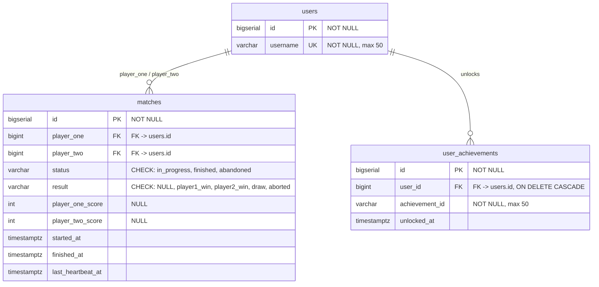

_This project has been created as part of the 42 curriculum by jpelline, anpollan, mhirvasm, zfarah and nraatika._

# Backend & Database

This repository hosts the **Go** Backend server, the **PostgreSQL** Database server, and related infrastructure code.

### Team Information

- **Lead Developer for Backend:** Niklas Raatikainen
- **Contributions:** Database schema design, authentication & session management, REST API handlers, real-time WebSocket hub, matchmaking lifecycle, progression system, leaderboard caching, and automated test suite.

---

## 1. System Architecture

The backend operates as an event-driven system with clean separation between user-facing REST APIs and the real-time WebSocket hub. The WebSocket engine never touches PostgreSQL directly; it interacts with persistence exclusively through internal HTTP endpoints, while REST handlers push state changes back to the WebSocket hub using Go channels (`EventNotifier`).

```
                              ┌──────────────────────────────────────────────┐
                              │             Caddy Reverse Proxy              │
                              └──────────────────────┬───────────────────────┘
                                                     │
                                                     ▼
                              ┌──────────────────────────────────────────────┐
                              │            Go Backend (go-server)            │
                              │                                              │
                              │      ┌────────────────────────────────┐      │
                              │      │           Middleware           │      │
                              │      │   (Logging, Guards, Context)   │      │
                              │      └───────────────┬────────────────┘      │
                              │                      │                       │
                              │       ┌──────────────┴──────────────┐        │
                              │       ▼                             ▼        │
                              │  ┌──────────┐  Internal REST    ┌──────────┐ │
                              │  │          │ ◄──────────────── │          │ │
                              │  │ Handlers │    (DataStore)    │ Realtime │ │
                              │  │  (REST)  │                   │   Hub    │ │
                              │  │          │ ────────────────► │          │ │
                              │  └────┬─────┘   EventNotifier   └──────────┘ │
                              └───────┼──────────────────────────────────────┘
                                      ▼
                              ┌──────────────────────────────────────────────┐
                              │            PostgreSQL 16 Database            │
                              └──────────────────────────────────────────────┘
```

---

## 2. Technical Stack

- **Core Runtime:** **Go (Golang)** utilizing standard library `http.ServeMux` (Go 1.22+ method + path patterns).
- **Database & ORM:** **PostgreSQL 16 Alpine** with **Bun ORM** (`github.com/uptrace/bun`).
- **Migrations:** Bun file-based SQL transactional migrations (`db/migrations/001` through `010`).
- **Edge Proxy:** **Caddy 2** (TLS termination, rate limiting, and route filtering).
- **Password Hashing:** `golang.org/x/crypto/bcrypt`.
- **Input Validation:** `github.com/go-playground/validator/v10` (`DecodeAndValidate[T]`).
- **Asymmetric Tokens:** `github.com/golang-jwt/jwt/v5` (RSA RS256 signing and verification).
- **Structured Logging:** Standard library `log/slog` with dynamic log levels and trace filters.

---

## 3. Database Schema

The database schema is organized into two focused domains: **Identity & Social Graph** and **Gameplay & Progression**.

### A. Identity, Sessions & Social Communication

Covers user credentials, active login sessions, friendship requests/blocks, profile wall comments, and direct chat messages:


```mermaid
erDiagram
    users ||--o{ sessions : "has"
    users ||--o{ friendships : "user / friend"
    users ||--o{ messages : "sender / recipient"
    users ||--o{ comments : "owner / poster"

    users {
        bigserial id PK "NOT NULL"
        varchar username UK "NOT NULL, max 50"
        varchar email UK "NOT NULL, max 100"
        varchar password_hash "NOT NULL, max 255"
        text bio "NOT NULL, default ''"
        varchar avatar_url "NULL, max 512"
        timestamptz created_at
        timestamptz updated_at
    }

    sessions {
        bigserial id PK "NOT NULL"
        bigint user_id FK "FK -> users.id, ON DELETE CASCADE"
        varchar session_token UK "NOT NULL, max 255"
        timestamptz created_at
        timestamptz expires_at
    }

    friendships {
        bigserial id PK "NOT NULL"
        bigint user_id FK "FK -> users.id, ON DELETE CASCADE"
        bigint friend_id FK "FK -> users.id, ON DELETE CASCADE"
        varchar status "CHECK: pending, accepted, blocked"
        timestamptz created_at
        timestamptz updated_at
    }

    messages {
        bigserial id PK "NOT NULL"
        bigint sender_id FK "FK -> users.id"
        bigint recipient_id FK "FK -> users.id"
        varchar content "max 2000"
        boolean is_read "default FALSE"
        timestamptz created_at
    }

    comments {
        bigserial id PK "NOT NULL"
        bigint owner_id FK "FK -> users.id, ON DELETE CASCADE"
        bigint poster_id FK "FK -> users.id"
        varchar content "max 1000"
        timestamptz created_at
    }
```

### B. Gameplay, Matchmaking & Progression

Covers match records, game results, keepalive heartbeats, and unlocked achievement badges:


```mermaid
erDiagram
    users ||--o{ matches : "player_one / player_two"
    users ||--o{ user_achievements : "unlocks"

    users {
        bigserial id PK "NOT NULL"
        varchar username UK "NOT NULL, max 50"
    }

    matches {
        bigserial id PK "NOT NULL"
        bigint player_one FK "FK -> users.id"
        bigint player_two FK "FK -> users.id"
        varchar status "CHECK: in_progress, finished, abandoned"
        varchar result "CHECK: NULL, player1_win, player2_win, draw, aborted"
        int player_one_score "NULL"
        int player_two_score "NULL"
        timestamptz started_at
        timestamptz finished_at
        timestamptz last_heartbeat_at
    }

    user_achievements {
        bigserial id PK "NOT NULL"
        bigint user_id FK "FK -> users.id, ON DELETE CASCADE"
        varchar achievement_id "NOT NULL, max 50"
        timestamptz unlocked_at
    }
```

---

## 4. Core Functionality by Domain

### A. Authentication & Dual-Token Security

- **User Registration (`POST /api/register`):** Validates input constraints (`username_safety` alphanumerics/dashes, `password_complexity` requiring 2+ character classes, and email format). Password hashes are generated via `bcrypt` and stored in PostgreSQL.
- **User Login (`POST /api/login`):** Authenticates credentials, generates a cryptographically secure 26-character session token, stores it in `sessions`, and attaches it as an `HttpOnly`, `SameSite` cookie (`session_id`) valid for 24 hours.
- **Token Renewal (`POST /api/renew`):** Protected by `SessionGuard`. Validates the cookie session against PostgreSQL and signs an asymmetric RSA short-lived JWT (`RS256`, 60-second lifetime). The JWT contains `user_id` and `username` claims and is used for `/api/protected/*` routes and WebSocket authentication.
- **Internal API Guard (`/api/internal/*`):** Protected by `APIGuard`. Verifies the pre-shared internal secret using constant-time comparison (`subtle.ConstantTimeCompare`) against `X-API-Key`. Caddy blocks external access to this route with a `404 Not Found`.

### B. User Profiles & Avatar Media

- **Private Profile (`GET /api/protected/profile`):** Returns authenticated user information, including private email, match statistics, unlocked badges, and progression info.
- **Public Profile (`GET /api/protected/profile/{username}`):** Redacts private email, calculates mutual friendship status relative to the caller (`none`, `pending`, `accepted`, `blocked`), and displays rank, badges, and stats.
- **Profile Updates & Password Changes:** `PATCH /api/protected/profile` updates bio, email, or avatar. `PATCH /api/protected/password` verifies the existing password and validates complexity on the new password.
- **GDPR Account Deletion (`DELETE /api/protected/profile`):** Soft-deletes the account by redacting bio, email, and avatar, setting `password_hash = 'deleted'`, and revoking all active sessions.
- **Sanitized Avatar Upload (`POST /api/protected/avatar`):** Enforces a 2MB limit, verifies image data (PNG, JPEG, GIF) via `image.Decode`, and re-encodes the image into a clean PNG file on disk to strip malicious polyglots. Generates timestamped synthetic filenames and cleans up old avatar files on disk.
- **Media Serving (`GET /api/uploads/{filename}`):** Public endpoint serving avatar files with strict path traversal defenses (`filepath.Base`).

### C. Profile Wall Comments

- **Wall Comments (`GET /api/protected/profile/{username}/comments`):** Retrieves comments posted on a user's profile wall using cursor pagination (`limit`, `last_shown_id`) with `has_more` overfetching (`limit+1`).
- **Post Comment (`POST /api/protected/profile/{username}/comments`):** Allows any authenticated user to leave a comment on their own or another user's wall.
- **Delete Comment (`DELETE /api/protected/profile/{username}/comments/{id}`):** Dual-authorization check: a comment can be deleted by **either** the person who wrote it or the profile owner whose wall it appears on.

### D. Friends & Direct Messaging

- **Friendship Lifecycle (`/api/protected/friends`):**
  - `POST /api/protected/friends`: Creates a `pending` friendship request.
  - `GET /api/protected/friends`: Returns friends with status and live unread message counts in a single SQL query with JOINs.
  - `PATCH /api/protected/friends/{id}`: Accepts, declines, or blocks requests. Accepting evaluates friendship achievements (`TriggerFriend`) and dispatches mutual presence updates.
  - `DELETE /api/protected/friends/{id}`: Unfriends a user and emits a real-time notification.
- **Chat History (`GET /api/protected/messages/{friend_name}`):** Retrieves historical messages exchanged between confirmed friends.
- **Read Receipts (`PATCH /api/protected/messages/{friend_name}/read`):** Batch-marks unread messages as read up to a specified message ID.
- **Message Persistence (`POST /api/internal/messages`):** Internal endpoint called by the WebSocket hub to persist messages after verifying mutual friendship.

### E. Match Management, Heartbeat & Stale Match Sweeper

- **Match Creation (`POST /api/internal/matches`):** Initiates a match record with `status = 'in_progress'`. Validates that players are distinct and ensures neither participant is already in an active match.
- **Match Conclusion & Scoring (`PATCH /api/internal/matches/{id}`):** Called by the Game Server on game finish. Automatically maps participant scores, infers the result (`player1_win`, `player2_win`, `draw`), marks the status as `finished`, evaluates post-match achievements, invalidates the leaderboard cache, and notifies both players via WebSocket.
- **Game Server Heartbeat (`PUT /api/internal/matches/{id}/heartbeat`):** Periodic keepalive sent by the game engine during live matches.
- **Active Match Reconnection (`GET /api/internal/users/{id}/active-match`):** Resolves whether a reconnecting player is currently part of an active match.
- **Background Stale Match Sweeper:** A periodic goroutine (`StartBackgroundSweeper`) identifies matches exceeding heartbeat thresholds, automatically transitions them to `abandoned`/`aborted`, and notifies players.
- **Match History (`GET /api/protected/matches`):** Paginated match history with opponent profile, user-relative scores, and calculated outcomes (`win`, `loss`, `aborted`).

### F. Progression, Achievements & Leaderboard

- **Progression System:** XP formula: `totalXP = (wins * 100) + (losses * 35)`, with computed level tiers and rank titles.
- **Achievement Badges:** Event-driven badge triggers (`TriggerMatch`, `TriggerFriend`, `TriggerProfile`) evaluated and granted idempotently (`ON CONFLICT DO NOTHING`).
- **Cached Leaderboard (`GET /api/leaderboard`):**
  - Sorts users by XP (default) or Win Rate with deterministic tie-breakers (Wins DESC, Games Played DESC, User ID ASC).
  - In-memory cache guarded by `sync.RWMutex` with double-checked locking, automatically invalidated on match completion or profile updates.

### G. Real-Time WebSocket Microservice (`/api/ws`)

- **Actor-Model Concurrency (Communicating Sequential Processes):** Runs on a single-threaded main event loop (`Hub.Run()`) using Go channels (`register`, `unregister`, `unicast`, `matchAction`) to receive data from child threads in a concurrency-safe way.
- **Client Goroutines:** Client reads, writes and in-memory states are managed in their own threads, inter-client communication goes through the central Hub thread.
- **TokenValidator Handshake:** Validates the RSA JWT on initial connection before upgrading to WebSocket.
- **Single Active Session Enforcement:** If a user connects from another tab or device, the previous connection is gracefully terminated with `logged_in_elsewhere`.
- **Live Presence Sync:** Notifies friends when a user comes online or goes offline.
- **Match Challenges (25s TTL):** Full challenge flow (`match_invite_send`, `match_invite_recv`, `match_invite_response`, `match_invite_cancel`). Features duplicate prevention, reverse-challenge safeguards, and disconnect sweeping.
- **Direct Messaging Relay:** Rate-limited direct message relay persisting to PostgreSQL via the internal REST API.
- **Active Match Reconnection:** Detects and restores active match sessions in memory when a player reconnects.

---

## 5. Endpoints Reference

### Public Routes

| Method | Path                      | Description                                                            |
| :----- | :------------------------ | :--------------------------------------------------------------------- |
| `POST` | `/api/register`           | Register new user account                                              |
| `POST` | `/api/login`              | Authenticate and issue session cookie                                  |
| `GET`  | `/api/health`             | Healthcheck endpoint (`{"status":"healthy"}`)                          |
| `GET`  | `/api/leaderboard`        | Get cached leaderboard (query: `sort=xp\|win_rate`, `limit`, `offset`) |
| `GET`  | `/api/uploads/{filename}` | Serve public avatar media                                              |

### Session-Protected Route

| Method | Path         | Description                                       |
| :----- | :----------- | :------------------------------------------------ |
| `POST` | `/api/renew` | Exchange `session_id` cookie for RS256 Bearer JWT |

### JWT-Protected Routes (`/api/protected/*`)

| Method   | Path                                              | Description                                                          |
| :------- | :------------------------------------------------ | :------------------------------------------------------------------- |
| `GET`    | `/api/protected/profile`                          | Get authenticated user's private profile                             |
| `PATCH`  | `/api/protected/profile`                          | Update bio, email, or avatar URL                                     |
| `GET`    | `/api/protected/profile/{username}`               | Get public profile for specified user                                |
| `DELETE` | `/api/protected/profile`                          | Soft delete account (GDPR compliant)                                 |
| `POST`   | `/api/protected/avatar`                           | Upload avatar image (multipart form, 2MB max)                        |
| `PATCH`  | `/api/protected/password`                         | Change password (verifies current password)                          |
| `GET`    | `/api/protected/profile/{username}/comments`      | Get profile wall comments (cursor paginated)                         |
| `POST`   | `/api/protected/profile/{username}/comments`      | Post comment on user's profile wall                                  |
| `DELETE` | `/api/protected/profile/{username}/comments/{id}` | Delete wall comment (author or wall owner)                           |
| `POST`   | `/api/protected/friends`                          | Send friend request (`{"target": "username"}`)                       |
| `GET`    | `/api/protected/friends`                          | Get friends list with unread message counts                          |
| `PATCH`  | `/api/protected/friends/{id}`                     | Respond to friend request (`status: accepted\|declined\|blocked`)    |
| `DELETE` | `/api/protected/friends/{id}`                     | Delete friendship                                                    |
| `GET`    | `/api/protected/messages/{friend_name}`           | Get chat history with friend                                         |
| `PATCH`  | `/api/protected/messages/{friend_name}/read`      | Mark messages as read (`{"read_up_to": <id>}`)                       |
| `GET`    | `/api/protected/matches`                          | Get match history (filters: `username`, `status`, `limit`, `offset`) |

### Internal Microservice Routes (`/api/internal/*`)

_Guarded by `APIGuard` requiring `X-API-Key`._

| Method  | Path                                    | Description                                                        |
| :------ | :-------------------------------------- | :----------------------------------------------------------------- |
| `POST`  | `/api/internal/matches`                 | Create match record (`{"player_one": "...", "player_two": "..."}`) |
| `PATCH` | `/api/internal/matches/{id}`            | Report match conclusion, scores, and status                        |
| `PUT`   | `/api/internal/matches/{id}/heartbeat`  | Update game server heartbeat timestamp                             |
| `GET`   | `/api/internal/users/{id}/active-match` | Check user's current in-progress match                             |
| `GET`   | `/api/internal/friends/{id}`            | Internal query for user's friends list                             |
| `POST`  | `/api/internal/messages`                | Internal chat message persistence                                  |

### Real-Time WebSocket Route

| Protocol | Path                  | Description                                                           |
| :------- | :-------------------- | :-------------------------------------------------------------------- |
| `WS`     | `/api/ws?token=<jwt>` | Authenticated WebSocket connection for presence, challenges, and chat |

---

## 6. Testing Principles & Test Suite

The test suite covers [`handlers/`](./go-server/handlers/), [`models/`](./go-server/models/), and [`realtime/`](./go-server/realtime/), adhering to strict Go testing standards:

1. **Table-Driven Test Suites:** Multi-scenario tests are structured as `tests := []struct { ... }` executed via subtests (`t.Run(tc.name, ...)`), verifying happy paths, edge boundaries, and error codes.
2. **Deterministic Cleanup with `t.Cleanup`:** Tests avoid raw `defer` in favor of `t.Cleanup(func() { ... })`. Test users, friendships, and matches clean up their own database records upon subtest completion.
3. **Data Race Detection Enforced:** All tests run with the `-race` flag enabled (`go test -race -count=1`), ensuring concurrency safety across WebSocket pumps, channels, and in-memory caches.
4. **Optimized Cryptographic Test Fixtures:** To keep tests fast under `-race`, the test fixture helper (`internal/testutil/user.go`) uses precomputed `bcrypt.MinCost` password hashes rather than running expensive bcrypt calculations repeatedly.
5. **Decoupled Unit Testing with Mocks:** WebSocket hub unit tests decouple from PostgreSQL by utilizing a mock `DataStore`, testing event frames, challenge TTLs, and disconnections in-memory.
6. **Live Migration Integration Testing:** Handlers and models test against a live PostgreSQL test instance initialized with the exact SQL migration files, verifying that Go models match actual database constraints.
7. **Zero-Dependency Standard Library Assertions:** Tests use standard library `t.Errorf` and `t.Fatalf` with descriptive error messages (`got %v, want %v`) rather than third-party assertion libraries.

### Running Tests

To run the automated test suite with race detection enabled across all packages:

```bash
# Execute test script from project root
./backend/scripts/run_tests.sh
```

Or run directly inside the container:

```bash
docker compose exec -T go-server go test -race -v -count=1 ./handlers ./models ./realtime
```

---

## 7. Setup & Development Instructions

### Secrets Setup

Secrets are stored in a `secrets/` directory parallel to the repository root. The root `Makefile` automatically generates missing secrets, or they can be created manually:

```bash
mkdir -p ../secrets
# PostgreSQL password
openssl rand -hex 10 > ../secrets/postgres_user_pw.txt
# JWT RSA key pair
openssl genpkey -algorithm RSA -out ../secrets/jwt_private.pem -pkeyopt rsa_keygen_bits:2048
openssl rsa -pubout -in ../secrets/jwt_private.pem -out ../secrets/jwt_public.pem
# Internal microservice API key
openssl rand -hex 32 > ../secrets/gameserver_api_key.txt
```

### Environment Configuration

Copy `.env.example` to `.env`:

```bash
cp .env.example .env
```

Key variables:

- `ENV`: Set to `development` to enable automatic database seeding (`db.SeedDevDatabase`) and `DEBUG` logging; set to `production` to skip seeding.
- `BACKEND_PORT`: Port for REST server (default `8080`).
- `WS_PORT`: Port for WebSocket microservice (default `8081`).
- `LOG_LEVEL`: Logging verbosity (`debug`, `info`, `warn`, `error`, `trace`).
- `BACKEND_TARGET`: set to `production` for a fast, standalone build, or `dev` for a hot-reloading development version

### Launching Services

```bash
# Launch database, backend, and reverse proxy
docker compose up -d --build
```

Once launched, Caddy exposes HTTPS on port `8443` (and HTTP port `8000` / `8080` for redirection). Database and Go server ports remain isolated within Docker bridge networks.
